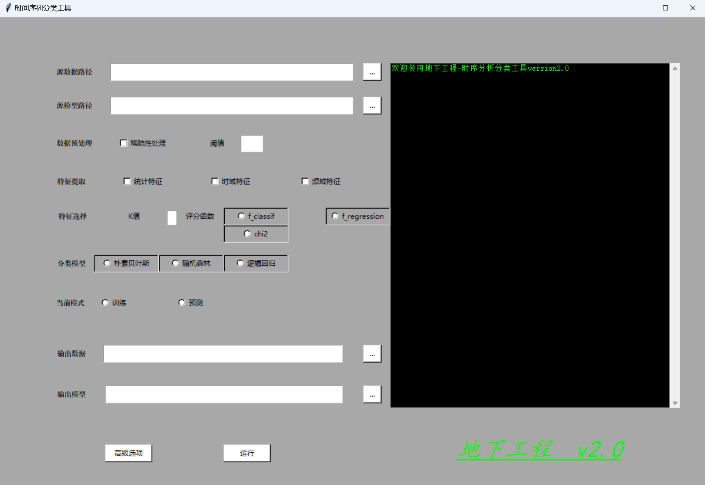

# 地下工程-时序分析分类工具

基于sklearn开源框架的带UI的机器学习单机工具，零上手成本，无需命令行。可用于各种基于统计量的时序分析，如传感器日志、金融股票数据等。

## 核心功能：

1\. 处理特定对象时间序列统计量的分析问题。

2\. 包含统计分析，时序分析，频域分析。

3\. 输出特征量化得分。

4\. 可选择多种分类模型进行时序分类。

## 安装指南：

1\. 安装 Python 3

推荐 Python 3.8+（确保兼容性）。

方法：

Windows/macOS：从 Python 官网 下载安装包，勾选 Add Python to PATH（Windows 需勾选）。

Linux（Ubuntu/Debian）：

bash

`    sudo apt update \&\& sudo apt install python3 python3-pip`

验证安装：

bash

`python3 --version  # 应显示 Python 3.x.x`

2\. 创建虚拟环境（可选但推荐）

避免污染全局 Python 环境：

bash

`python3 -m venv myenv      # 创建虚拟环境

source myenv/bin/activate  # 激活（Linux/macOS）

myenv\\Scripts\\activate     # 激活（Windows）`

3\. 安装依赖库

使用 pip 安装 pandas、scikit-learn（sklearn）、tsfresh：

bash

`pip install pandas scikit-learn tsfresh`

验证安装：

bash

`python3 -c "import pandas, sklearn, tsfresh; print('安装成功！')"`

4\. 常见问题解决

权限错误：在命令前加 sudo（Linux/macOS）或以管理员身份运行终端（Windows）。

安装慢：使用国内镜像源（如清华源）：

bash

`pip install -i https://pypi.tuna.tsinghua.edu.cn/simple pandas scikit-learn tsfresh`

依赖冲突：建议用虚拟环境隔离项目。

联系方式：

xxx@gmail.com

